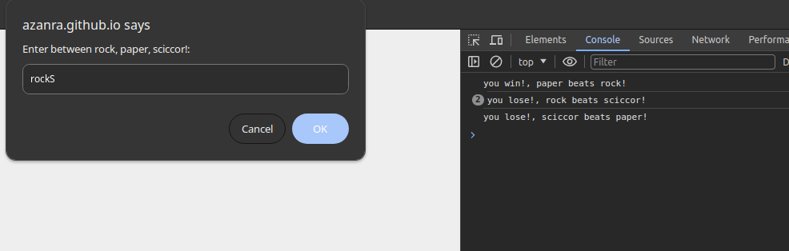

# rock-paper-sciccors

## links
- [Live preview](https://azanra.github.io/rock-paper-sciccors/)
- [Assignment page](https://www.theodinproject.com/lessons/foundations-rock-paper-scissors)

## about
This project contain a simple game of rock, paper, sciccor.
The game will be played in 5 round, player wil be asked to 
input their choice against computer. For now the game will
be played in the console, but i will add GUI later on, The
project focus on basic javascript, like function, loops, 
conditions.

## screenshot

