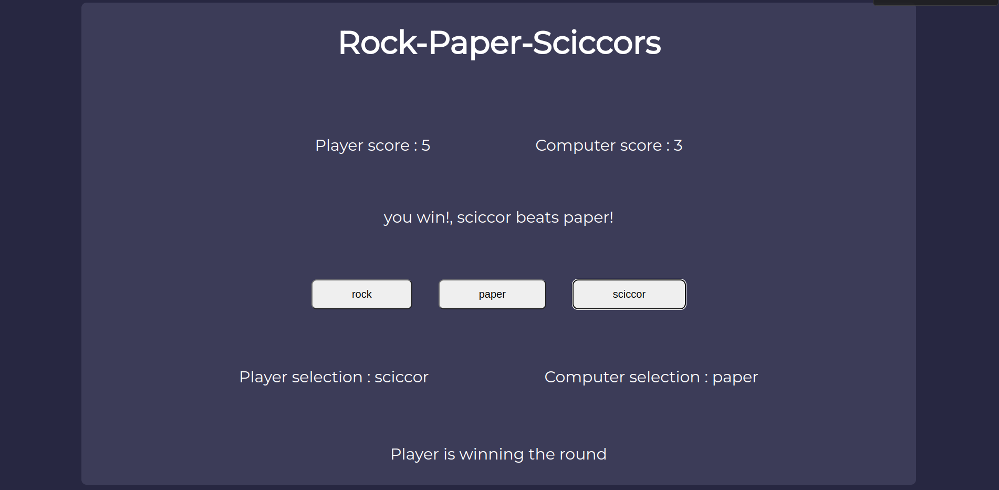

# rock-paper-sciccors

## Links
- [Live preview](https://azanra.github.io/rock-paper-sciccors/)
- [Assignment page](https://www.theodinproject.com/lessons/foundations-rock-paper-scissors)

## About
This project contain a simple game of rock, paper, sciccor.
The player will input their choice by button and the one 
who reach 5 points first will be the winner of the round.
The project focus on manipulating the DOM, style with css,
,the use of of basic method and property  of javascript. 

## Screenshot

